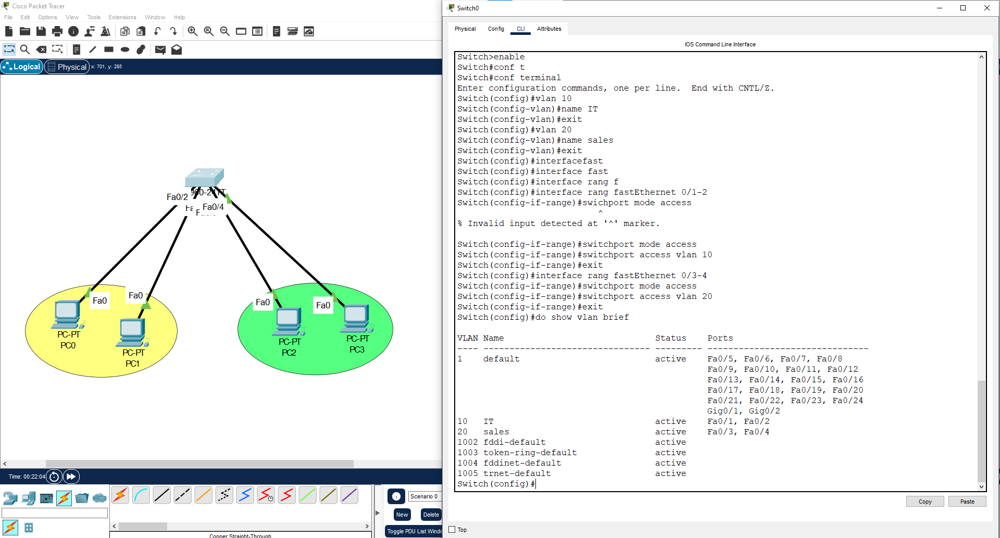

# Lab 02: Dividing a Network into Multiple VLANs

**Section:** Networking & Switching Fundamentals
**Tool:** Cisco Packet Tracer

## 🎯 Objective
Understand how to logically isolate devices within the same switch using VLANs.

## 🧰 Devices Used
| Device | Qty |
|---|---|
| PC | 4 |
| Switch 2960 | 1 |

## 🗺️ Steps
1. Create VLAN 10 and VLAN 20 on the switch (`vlan 10`, `vlan 20`).
2. Assign each access port to the appropriate VLAN (`switchport access vlan`).
3. Verify that devices in the same VLAN can communicate, and devices in different VLANs cannot.

## ✅ Expected Result
PCs in the same VLAN reply to ping; PCs in different VLANs do not, confirming Layer 2 isolation.

## 📸 Screenshot

